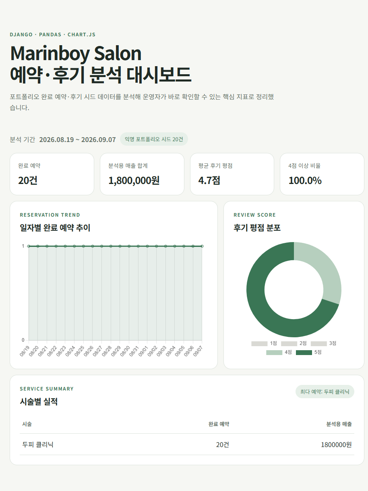

# AI Full Stack Portfolio

Java와 Spring 기반 백엔드부터 웹 프론트엔드, 데이터베이스, 배포까지 학습하며 만든 프로젝트를 기록하는 저장소입니다. 단순 기능 구현을 넘어 비즈니스 규칙, 데이터 흐름, 사용자 경험을 함께 설계하는 것을 목표로 합니다.

## 대표 프로젝트: Marinboy

**Marinboy**는 1인 미용실·뷰티샵 운영자를 위한 예약 관리 서비스입니다. 고객은 시술 정보와 이미지를 확인해 예약을 신청하고, 관리자는 예약 상태와 휴무일, 시술 메뉴, 갤러리, 추천 메뉴를 한곳에서 관리할 수 있습니다.

### 핵심 기능

- 고객/관리자 세션 로그인과 역할별 접근 제어
- 시술별 소요 시간을 반영한 30분 단위 예약 가능 시간 계산
- 영업시간(10:00~20:00), 일요일·휴무일, 예약 시간 중복 검증
- `REQUESTED → CONFIRMED → COMPLETED/NO_SHOW` 중심의 상태 전이 관리
- 시술 메뉴·가격·소요 시간 및 대표/추가 이미지 갤러리 관리
- 이달의 추천 TOP3 메뉴 노출과 중복 순위 자동 해제
- 고객별 시술 이력 조회 및 노쇼 연락처 재예약 제한
- DTO 기반 요청/응답 분리와 일관된 JSON API 오류 처리
- H2 로컬 실행 및 Oracle XE 프로필 지원

### 기술 스택

| 영역 | 기술 |
| --- | --- |
| Backend | Java 17, Spring Boot 3.5.3, Spring Web, Bean Validation |
| View | Thymeleaf, HTML, CSS, JavaScript |
| Data | Spring Data JPA, H2, Oracle XE |
| Auth | Session, Interceptor, OAuth2 Client |
| Test | JUnit 5, Spring Boot Test, Maven |

### 설계 포인트

```text
Browser → JavaScript fetch → Controller → Service → Repository → Database
                                               ↓
                                  비즈니스 규칙 검증 및 DTO 변환
```

- 시작 시각만 비교하지 않고 시술 종료 시각까지 계산해 예약 구간의 겹침을 차단합니다.
- 화면 검증과 별개로 Service에서 휴무일, 영업시간, 노쇼 이력을 다시 검증합니다.
- Entity를 직접 노출하지 않고 요청/응답 DTO로 API 계약과 데이터 모델을 분리합니다.

### 실행 및 테스트

프로젝트는 `feature/marinboy-reservation-service` 브랜치의 `marinboy` 디렉터리에 있습니다.

```bash
git switch feature/marinboy-reservation-service
cd marinboy
mvn spring-boot:run
```

실행 후 `http://localhost:8080`에서 확인할 수 있습니다.

```bash
# 전체 테스트
mvn test

# Oracle XE 프로필 실행
mvn spring-boot:run "-Dspring-boot.run.profiles=oracle"
```

Oracle 접속 정보는 `ORACLE_URL`, `ORACLE_USERNAME`, `ORACLE_PASSWORD` 환경 변수로 변경할 수 있습니다.

### 최근 구현 하이라이트

- 예약 메뉴와 시술 이미지 갤러리의 탐색 경험 개선
- 관리자 예약 확정·취소·완료·노쇼 처리 흐름 보완
- 메뉴 이미지 업로드, 추가 이미지 최대 3장, TOP3 큐레이션 구현
- 고객 예약 가능 시간 조회와 중복 예약 방지 로직 강화
- 기능 브랜치: `feature/marinboy-reservation-service`
- 주요 커밋: `8e065daf` 최초 예약 서비스, `1d8faa90` Oracle 포트폴리오, `d781837e` 관리자 흐름 수정, `1912d021` 메뉴·갤러리 개선

## 데이터 분석 프로젝트: Marinboy Salon 대시보드

Marinboy Salon 포트폴리오의 완료 예약·후기 시드 20건을 바탕으로, **Django + Pandas + Chart.js** 분석 대시보드를 만들었습니다. 원본 운영 DB에 직접 접속하지 않고 익명 분석 CSV와 Django SQLite를 사용해 예약·후기 데이터를 안전하게 집계했습니다.

<p align="center">
  
</p>

| 바로 보기 | 설명 |
| --- | --- |
| [대시보드 소스·실행 방법](Track/track010_python+django/PORTFOLIO_DASHBOARD_README.md) | Django 마이그레이션, CSV 적재, 로컬 실행 순서를 확인합니다. |
| [분석 결과보고서](Track/track010_python+django/report/ANALYSIS_REPORT.md) | 데이터 기준, Pandas 분석 흐름, 핵심 지표와 인사이트를 확인합니다. |
| [원본 분석 CSV](Track/track010_python+django/project/analytics/data/portfolio_reservations.csv) | 개인정보를 제외한 20건의 분석용 예약·후기 데이터입니다. |

### 분석 결과

- 완료 예약 **20건**, 분석용 매출 합계 **1,800,000원**, 평균 후기 평점 **4.7점**을 확인했습니다.
- 후기 20건 모두 4점 이상이었고, 4점 후기의 상담·손질 관련 의견을 개선 포인트로 제시했습니다.
- 현재는 단일 메뉴 시드이므로, 이후 실제 메뉴별 예약 데이터를 추가해 객단가·평점·예약 비중을 비교 분석할 수 있도록 구성했습니다.

## 학습 기술

`Java` · `Spring Boot` · `JSP/Thymeleaf` · `MyBatis/JPA` · `Oracle/MySQL/H2` · `Python` · `Django` · `Pandas` · `Chart.js` · `HTML/CSS/JavaScript` · `React` · `Git/GitHub`

## Links

- GitHub: [marlboros9889/AI_Full_stack](https://github.com/marlboros9889/AI_Full_stack)
- Portfolio: [GitHub Pages](https://marlboros9889.github.io/AI_Full_stack/)
- Email: marlboros9889@gmail.com
