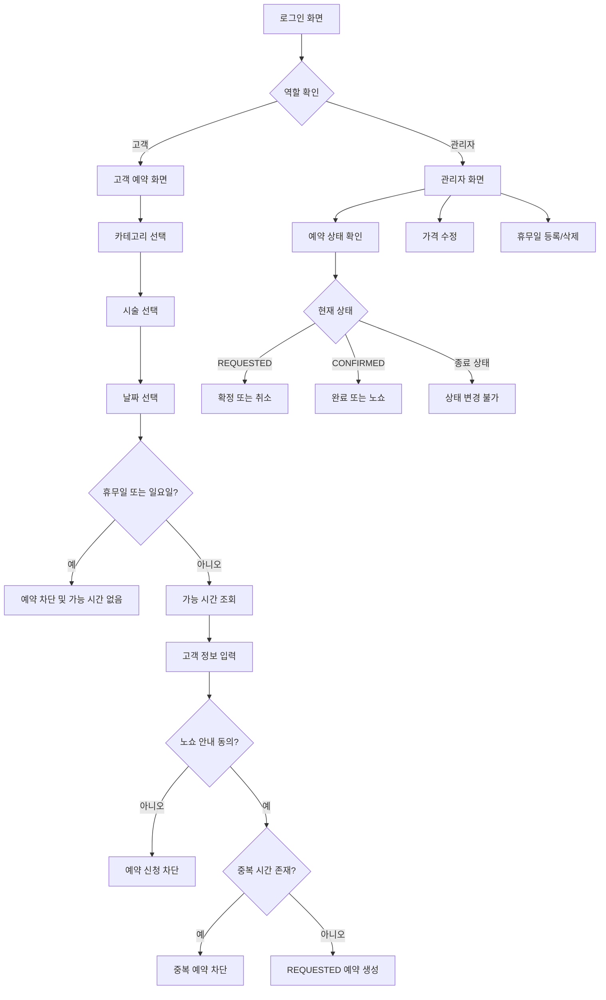
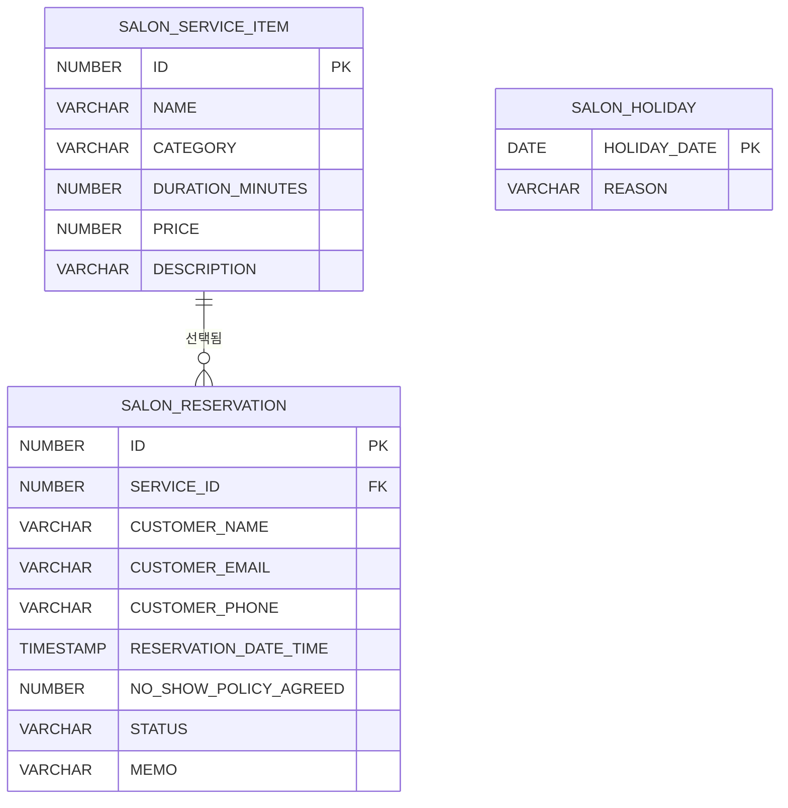
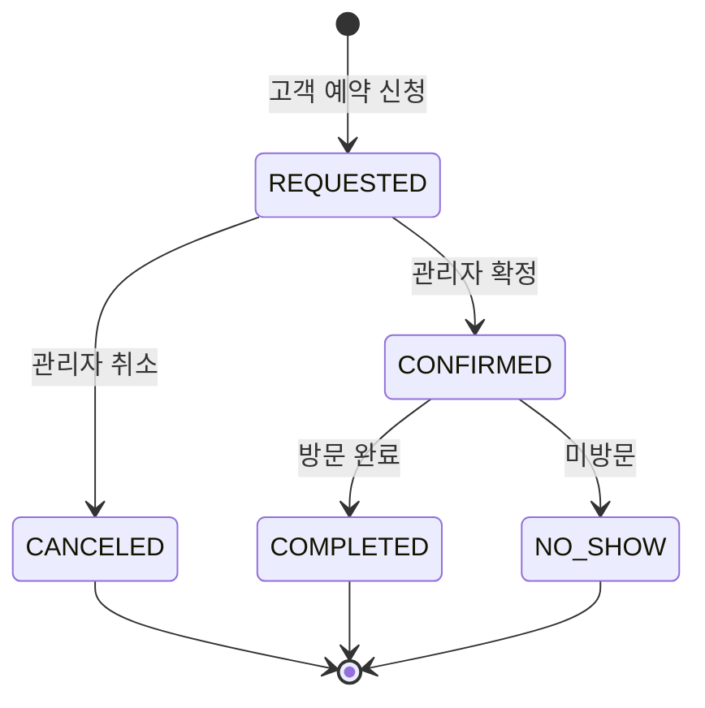

# Marinboy 구글 시트용 다이어그램 원본

## 사용자 흐름도

## ERD

## 상태 전환도

## 피그마 작성 메모

- 화면은 `로그인`, `고객 예약`, `관리자 대시보드` 3개 프레임으로 나눕니다.
- 고객 화면은 카테고리 선택, 시술 카드, 예약 폼을 한 흐름으로 배치합니다.
- 관리자 화면은 예약 상태 관리, 가격 수정, 휴무일 관리, 노쇼 알림 대상을 카드 섹션으로 분리합니다.
- 디자인은 추후 교체하기 쉽도록 기능 단위 컴포넌트 중심으로 작성합니다.
